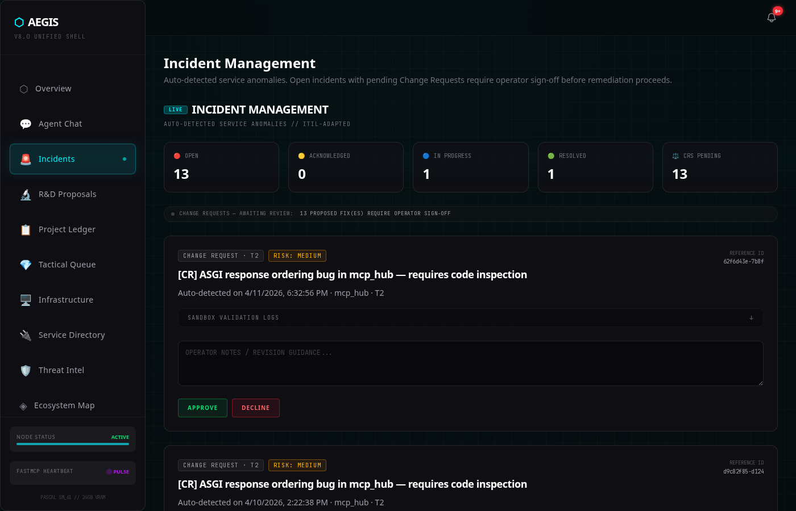
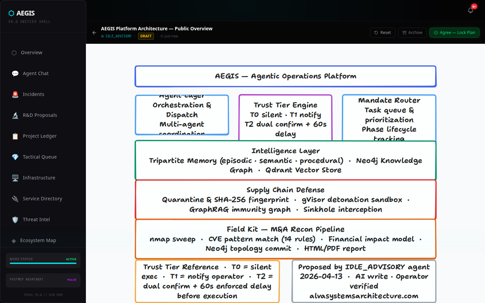

# AEGIS

> **Ground Truth. Not Log Truth.**

**What this is:** AEGIS is a production-grade agentic operations platform running on bare metal at [Alva Systems Architecture LLC](https://alvasystemsarchitecture.com). It is deployed today for active client engagements — M&A security due diligence, infrastructure auditing, and fractional CTO work. This repo documents the public architecture, trust model, and open specifications. The core implementation is proprietary.

---

AEGIS is an agentic operations platform built for organizations that need AI agents to act with precision, accountability, and architectural memory — not just in a single session, but across the full lifecycle of an engagement.

It started as a supply chain immune system. It became the operating layer for everything that runs on top of it.

---


*Incident management — live feed with severity classification, automated triage metadata, and operator review queue*


*Whiteboard — the IDLE_ADVISORY agent proposed this architecture diagram autonomously; an operator reviewed and locked it*

---

## The Problem

Modern AI agents are stateless, trust-blind, and amnesiac. They hallucinate dependencies, forget architectural decisions between sessions, and have no principled model for when to act autonomously versus when to stop and ask. In a security or M&A context, those gaps are not inconveniences — they are liabilities.

**Slopsquatting** alone illustrates the risk: LLMs hallucinate roughly 20% of package dependency names ([Spracklen et al., USENIX Security 2025](https://arxiv.org/abs/2406.10279)), with a 43% repetition rate — meaning attackers can predict and pre-register those names on PyPI or npm. Without an interception layer, an autonomous agent will fetch, install, and execute that payload with no human in the loop.

That was the first thing AEGIS was built to stop.

---

## What AEGIS Does

AEGIS provides four interlocking layers:

### 1. Supply Chain Defense
Every dependency request from an agent is intercepted before it touches the host. Packages are quarantined, fingerprinted, and detonated in an isolated behavioral sandbox before any code runs. Threat results are mapped to a Neo4j knowledge graph — flagged packages create permanent immunity nodes, so future agent iterations are blocked before a download even begins.

### 2. Tripartite Memory
Context windows are finite. Architectural decisions, client constraints, infrastructure state, and hard-won debugging lessons should not be. AEGIS uses a layered memory architecture — episodic, semantic, and procedural — stored in a vector database and queryable at session start. Agents begin informed, not blank.

Available as a standalone library: [`tripartite-memory`](https://pypi.org/project/tripartite-memory/) · [GitHub](https://github.com/LavaDMan/aegis-memory)

### 3. Trust-Tiered Autonomy
Not every action carries the same risk. AEGIS classifies all agent actions across three tiers:

| Tier | Name | Behavior |
|------|------|----------|
| **T0** | Silent | Agent acts autonomously — low blast radius, fully reversible |
| **T1** | Notify | Agent acts, operator is notified in real time |
| **T2** | Approval | Agent pauses, operator must confirm; 60-second enforced delay before execution |

The trust tier model is declarative and auditable. Every T1/T2 outcome writes to an audit log. Every T2 action requires dual confirmation.

Full spec: [`docs/trust-tier-spec.md`](docs/trust-tier-spec.md)

### 4. Field Kit — M&A Recon Pipeline
When an organization is acquired or evaluated, the security posture of its network is rarely what the paperwork says. AEGIS Field Kit is a portable recon pipeline that produces a structured, AI-readable security assessment of an unknown network — open ports, service fingerprints, CVE pattern matching, financial risk modeling, and a graph-committed topology — in a single command.

Traditional IT due diligence asks the CTO what his architecture looks like. Field Kit proves it.

Designed for M&A due diligence, incident response, and fractional CISO engagements.

---

## Architecture Overview

```
┌─────────────────────────────────────────────────────────┐
│                      AEGIS Platform                     │
│                                                         │
│  ┌──────────────┐  ┌──────────────┐  ┌───────────────┐  │
│  │  Agent Layer │  │  Trust Tier  │  │ Mandate Router│  │
│  │  (Orchestr.) │  │  T0/T1/T2    │  │  (Task Queue) │  │
│  └──────┬───────┘  └──────┬───────┘  └───────┬───────┘  │
│         │                 │                  │          │
│  ┌──────▼─────────────────▼──────────────────▼───────┐  │
│  │              Intelligence Layer                   │  │
│  │   Tripartite Memory · Neo4j Graph · Vector Store  │  │
│  └──────────────────────────┬────────────────────────┘  │
│                             │                           │
│  ┌──────────────────────────▼────────────────────────┐  │
│  │               Supply Chain Defense                │  │
│  │ Quarantine · Detonation Sandbox · GraphRAG Immune │  │
│  └───────────────────────────────────────────────────┘  │
└─────────────────────────────────────────────────────────┘
```

---

## Open Source Components

| Component | Description | Link |
|-----------|-------------|------|
| `tripartite-memory` | Layered memory SDK for agentic systems | [PyPI](https://pypi.org/project/tripartite-memory/) · [GitHub](https://github.com/LavaDMan/aegis-memory) |
| Trust Tier Spec | T0/T1/T2 action classification standard | [`docs/trust-tier-spec.md`](docs/trust-tier-spec.md) |

---

## Design Principles

**Blast radius before autonomy.** Before an agent acts, the platform evaluates reversibility, affected systems, and authorization scope. Destructive or externally-visible actions require explicit escalation.

**Memory outlives context.** No architectural decision, infrastructure constraint, or client requirement should have to be re-explained because a session ended.

**Audit everything that matters.** T1 and T2 actions produce immutable audit records. Agents don't self-report — the platform records outcomes independently.

**Local-first.** AEGIS runs on-premises. Your client data, threat findings, and architectural memory do not leave your infrastructure.

---

## Work With Us

AEGIS is in active development and production use at [Alva Systems Architecture LLC](https://alvasystemsarchitecture.com). The platform is not available as a self-hosted product.

We take on a small number of engagements at a time:

- **M&A Technical Due Diligence** — Field Kit deployment against a target network before or during acquisition. You get a structured security assessment, CVE findings, financial risk model, and graph-committed topology. The CTO doesn't get to curate the results.
- **Fractional CTO / Security Advisory** — For organizations evaluating AI automation, building internal agent pipelines, or needing architectural accountability they can show to a board or acquirer.
- **Trust-Tiered Agent Architecture** — Consulting on implementing the T0/T1/T2 model in your own agentic systems.

**→ [alvasystemsarchitecture.com](https://alvasystemsarchitecture.com)**

---

## Origin

AEGIS began as a response to a specific, observable threat: autonomous agents installing hallucinated packages without any interception layer. The first version was a single MCP microservice — a detonation sandbox with a Neo4j immunity graph — designed to sit at the tool-call boundary and block supply chain attacks before they reached the host kernel.

That problem turned out to be a symptom of a deeper architectural gap: agents with no memory, no trust model, and no accountability layer. AEGIS expanded to fill that gap.

The supply chain defense layer is still there. Everything else grew around it.

---

*Built by [Alva Systems Architecture LLC](https://alvasystemsarchitecture.com)*
*License: Apache 2.0*
